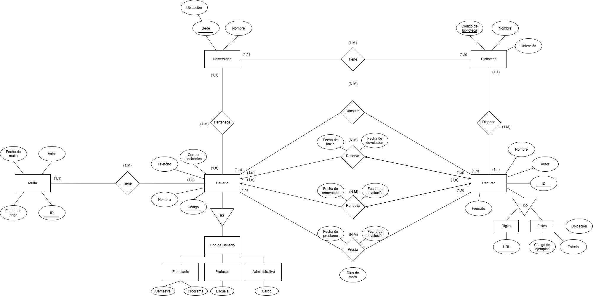

# CONSULTA DE EXPLORACIÓN
## Sistema de gestión de una biblioteca universitaria

---

## 1. Contexto del problema y conceptos importantes de sistema de gestión de una biblioteca universitaria

Para las bibliotecas hay la necesidad latente de organizar y automatizar procesos como consulta, préstamo, devolución, renovación y reserva de recursos bibliograficos de acuerdo a su disponibilidad. La implementación de un sistema de gestión de bibliotecas permite optimizar la administración de libros, tesis, revistas y otros recursos en diferentes formatos, facilitando su organización y consulta, evitando conflictos en los préstamos, a la vez que mejora el acceso y la experiencia de los usuarios: estudiantes, docentes y administrativos.

### Sistema de Gestión de Bibliotecas
Se refiere a un conjunto automatizado que contemple las funciones de recopilación, almacenamiento, búsqueda y distribución del material bibliográfico de forma que se puedan satisfacer las necesidades y demandas de la institución, y al mismo tiempo mejorar la experiencia de los usuarios.

### Usuarios (estudiantes, docentes y administrativos)
Para los usuarios en general el sistema de gestión debe contar con un panel administrativo de usuario que permita la búsqueda sistemática de recursos, verificación de la disponibilidad, la solicitud y el seguimiento en los préstamos, guardar colecciones de recursos previos, la gestión de pagos en el caso de multas y otras acciones que mejoren la experiencia al usuario.

### Libros y otros recursos bibliográficos
Contempla la adquisición, donación o canje de los recursos bibliográficos con otras organizaciones y distribuidores, sean libros, tesis, revistas y/o recursos audiovisuales en distintas áreas del conocimiento. Asegurando un acceso a información internacional y la calidad en la recuperación de la información por parte del usuario, para lo que se requiere aplicar criterios de selección que garanticen la veracidad y relevancia de los recursos adquiridos tanto físicos como digitales.

### Préstamo y devolución del material
Implica la administración por parte de los usuarios de las solicitudes para adquirir recursos físicos de la biblioteca, en una red que actualice la disponibilidad y establezca el cronograma para el recurso determinado de forma que se eviten superposiciones en el préstamo de materiales.

### Renovación de préstamos
Aplica para los materiales físicos de la biblioteca, y es la extensión del tiempo de uso de un recurso ya prestado, sujeta a la disponibilidad del material (que no esté reservado por otro usuario) y la verificación de paz y salvos o el sobrepaso del límite de renovaciones permitidas, de forma que se asegure que otros usuarios también puedan prestar el material.

### Reserva de libros
Una reserva se trata de pedirle a la biblioteca que cuando un documento que en ese momento se encuentra prestado, tengamos la prioridad para pedirlo prestado.

Se debe tener en cuenta que, solo se puede reservar sobre ejemplares prestados, la reserva se realiza sobre un ejemplar específico y no sobre un título. Además, la biblioteca tiene la obligación de informar sobre el tiempo de espera al usuario.

### Catálogo bibliográfico
Es un registro organizado que contiene la descripción de todos los materiales disponibles en una biblioteca incluye libros, revistas, tesis, entre otros. Cada registro comprende datos como autor, editorial, título, año de publicación, clasificación y ubicación del material bien sea física o digital.

### Disponibilidad de ejemplares
Se refiere a la disponibilidad del material dentro de la biblioteca, bien sea disponibilidad física o digital de la revista, libro, artículo, tesis u otros recursos.

### Multas por retraso o no devolución
Las multas son sanciones administrativas aplicadas a los usuarios que incumplen con los plazos estipulados para la entrega del material. Estas pueden ser recargos económicos, suspensión temporal o restricciones para realizar reservas u otros servicios, todo ello de acuerdo a las políticas propias de la biblioteca.

### Gestor de bases de datos
Los gestores de datos comprenden como una capa intermedia entre los programas que utiliza el usuario y el sistema operativo del mismo. Son los encargados de establecer comunicación entre los dos sistemas indicados anteriormente. Este gestor presta los siguientes servicios: definición y creación de la base de datos, manipulación de los datos, acceso controlado de los datos por medio de mecanismos de seguridad, mantener la integridad de los datos, mecanismos de copias de respaldo y recuperación con el fin de poder restablecer la información en caso de fallos del sistema.

---

## 2. Tendencias actuales en dichos conceptos

Las tendencias actuales en los sistemas de gestión de bibliotecas (ILS) se encaminan hacia el almacenamiento de información en la nube, la asistencia con inteligencia artificial para el uso de chatbots, la implementación de sistemas de recomendación de lecturas y la optimización de procesos internos. Con la finalidad de ofrecer una mejor organización y recuperación de información lo que permite mejorar la eficiencia y experiencia del usuario.

Los ILS cuentan con un modelo de usuarios, basado en el rol que le corresponde a cada persona; dependiendo del rol que desempeñan pueden obtener ciertos beneficios adicionales o controles administrativos, gestionados idealmente mediante un sistema de identidad digital única. Asimismo los libros y otros recursos bibliográficos se registran en la nube donde se almacenan en un único sistema integrado que centraliza y optimiza tareas operativas esenciales como la catalogación, consultas, registros de usuarios, préstamos, devoluciones y renovación automatizada.

Los sistemas gestores de bases de datos (SGBD) permiten la creación, gestión y administración de bases de datos, así como el manejo y elección de las estructuras necesarias para el almacenamiento y búsqueda de información para garantizar la máxima eficiencia en el acceso a los datos. Por ejemplo, para la búsqueda de algún material el usuario puede ingresar palabras pertenecientes al título del material, el autor, el tema, el código de barras, además se puede filtrar el contenido por rango de publicación, idioma, ubicación o disponibilidad.

Otra tendencia importante en los sistemas de gestión de bibliotecas es la integración con otras plataformas institucionales, usando APIs y herramientas que permiten el intercambio de información con sistemas académicos, repositorios digitales y plataformas de aprendizaje.

También se han incorporado herramientas de análisis de datos que permiten generar estadísticas sobre el uso de los servicios y los recursos, identificar patrones de consulta y facilitar la toma de decisiones; estas herramientas pueden complementarse con inteligencia artificial y aprendizaje automático para analizar mucha información y ofrecer recomendaciones de contenido de acuerdo con los intereses y necesidades de los usuarios.

Por otra parte, la seguridad y protección de la información se han convertido en aspectos fundamentales debido al manejo de datos personales y registros de actividad. Los sistemas actuales incorporan mecanismos de autenticación, autorización, control de acceso, copias de seguridad y protección de las bases de datos para garantizar la confidencialidad, integridad y disponibilidad de la información. También existe una tendencia hacia la automatización y el acceso multiplataforma, permitiendo que los servicios puedan ser utilizados desde computadores y dispositivos móviles, mientras que diferentes procesos administrativos se realizan de forma automática, reduciendo la intervención manual y mejorando la eficiencia general del sistema.

---

## 3. Consultar y analizar al menos 2 herramientas existentes en el mercado para el problema o situación asignado

Para resolver la situación asignada, en este caso, un sistema de gestión de una biblioteca universitaria, actualmente el mercado ofrece software especializado tipo ILS (*Integrated Library System*) y repositorios institucionales, que permiten automatizar procesos como préstamos, catalogación, control de usuarios y acceso a la información. Se analizaron dos herramientas de código abierto ampliamente adoptadas por instituciones académicas:

### Koha
Es uno de los sistemas de biblioteca más comunes, conocido porque se puede personalizar por completo y adaptar a las necesidades de una institución en específico (software de código abierto). Este sistema permite la gestión de los datos relacionados con el ciclo físico de los libros existentes en una biblioteca (préstamos, devoluciones, reservas, multas), además, es capaz de gestionar colecciones digitales dentro del mismo catálogo y aplicación. Incluye un catálogo público en línea (OPAC), donde los usuarios pueden buscar, consultar y comprobar la disponibilidad de los distintos materiales (tanto físicos como digitales).

### DSpace
Es una plataforma creada para guardar y dar acceso abierto a la producción académica de una institución como tesis, artículos e informes de investigación, en lugar de gestionar el préstamo de documentos físicos. Organiza y facilita el acceso a recursos académicos para estudiantes e investigadores en diferentes disciplinas. Inicialmente fue desarrollada en el MIT y Hewlett-Packard, y ha sido usada por más de 3.000 instituciones en el mundo, con la misión de capturar, almacenar, indexar, preservar y redistribuir la producción intelectual de una organización.

### Tabla comparativa

| Aspecto | Koha | DSpace |
|---|---|---|
| **¿Para qué sirve?** | Gestionar préstamos físicos y también colecciones digitales | Almacenar y dar acceso a documentos digitales |
| **¿Qué gestiona?** | Circulación, catálogo, usuarios, multas, colecciones digitales | Tesis, artículos, trabajos de investigación |
| **Diferencia** | Circulación (préstamos y devoluciones) | Preservación y acceso abierto a documentos digitales |
| **Costo** | Gratuito (software libre) | Gratuito (software libre) |

El uso y selección del software depende netamente de las necesidades y problemáticas de la institución, donde deberán primar los aspectos más importantes para ellos.

---

## 4. Diagrama Entidad Relación

---

## Referencias Bibliográficas

- Aprende Biblioteconomía: puntualizaciones para realizar reservas de documentos en bibliotecas – Academia Auxiliar de Biblioteca. (s. f.). https://www.auxiliardebiblioteca.com/aprende-biblioteconomia-reservas-bibliotecas/
- Breeding, M. (2025, 5 enero). *Tendencias tecnológicas en bibliotecas 2024: Los sistemas de gestión bibliotecaria*. Nora Quiroz. https://www.noraquiroz.com/post/tendencias-tecnol%C3%B3gicas-en-bibliotecas-2024-los-sistemas-de-gesti%C3%B3n-bibliotecaria
- Crespo, B. *Bibliotecas digitales y actividad bibliotecaria*. Researchgate.net. https://www.researchgate.net/profile/Luis-Bermello/publication/265758359_Bibliotecas_digitales_y_actividad_bibliotecaria/links/555cb58d08ae6f4dcc8bcc91/Bibliotecas-digitales-y-actividad-bibliotecaria.pdf
- García, A. A. R. (2012). El proceso de catalogación: esquemas, principios y prácticas contemporáneas. *Biblioteca universitaria*, 15(2), 139-146.
- Geraldine Trujillo. (1 noviembre, 2024). *Recomendaciones de software de gestión para bibliotecas y archivos en 2024*. Paideia Studio [Blog]. https://doi.org/10.62059/paideia.studio.17593
- Lenz, H. (2025, 18 marzo). *DSpace Home - DSpace*. DSpace. https://dspace.org/
- Marín, R. (2026, 16 julio). *Los gestores de bases de datos más usados en la actualidad*. Canal Informática y TICS. https://www.inesem.es/revistadigital/informatica-y-tics/los-gestores-de-bases-de-datos-mas-usados
- Mieles, J. M. G., & Toro, D. P. B. (2018). *Los sistemas de gestión bibliotecarios y su uso en las universidades manabitas*. Dialnet. https://dialnet.unirioja.es/servlet/articulo?codigo=9767250
- *Official Website of Koha Library Software*. (s. f.). https://koha-community.org/
- Ramírez, R. Z., & MEDIO, C. F. G. (2008). Sistemas gestores de base de datos. *Innovación y Experiencias Educativas*.
- Vega, E. G., & Martín, A. E. (2016). *Sistemas Integrales de Gestión para Bibliotecas*. Dialnet. https://dialnet.unirioja.es/servlet/articulo?codigo=5454192
- Xercode. (2024, 26 febrero). *¿Qué es y qué funciones tiene el sistema de gestión de bibliotecas?* Xercode. https://xercode.com/que-es-y-que-funciones-tiene-el-sistema-de-gestion-de-bibliotecas/
