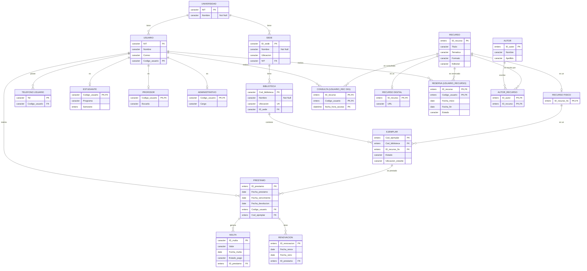
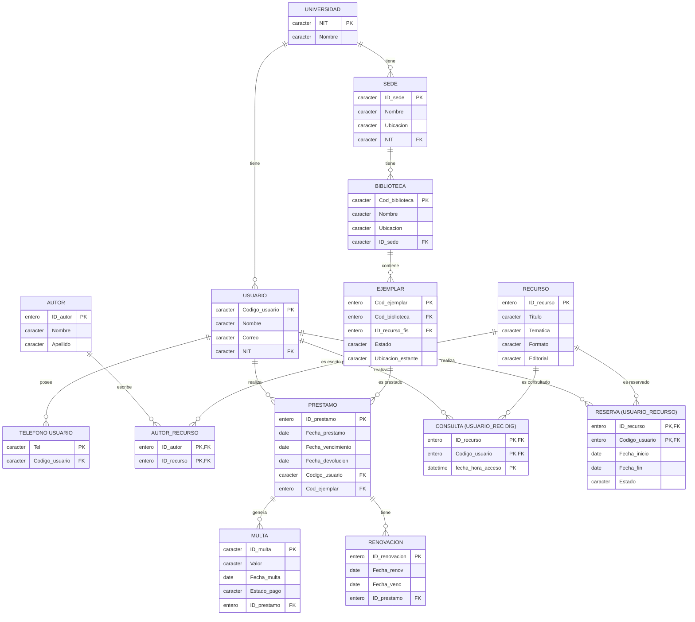
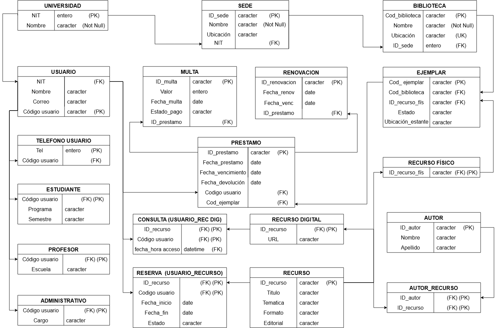

# INFORME DE NORMALIZACIÓN DE BASE DE DATOS
---
### 1. Introducción y Justificación del Nivel de Normalización

Este documento detalla el proceso de transformación del Modelo Entidad-Relación presentado con anteriorirdad del sistema de biblioteca universitaria a un Modelo Relacional normalizado. 

**Justificación del nivel alcanzado:**
El objetivo principal de la normalización es eliminar la redundancia de datos y evitar anomalías de inserción, actualización y eliminación. Para este sistema se ha decidido normalizar hasta la `Tercera Forma Normal`. 

Llegar a 3FN garantiza que:
1.  Cada dato se almacene en un solo lugar.

2.  Las actualizaciones como el cambio de estado de un préstamo o el pago de una multa sean consistentes y eficientes.

3.  Se mantenga la integridad referencial mediante el uso de llaves primarias (PK) y foráneas (FK).

No se aplicó la Forma Normal de Boyce-Codd (FNBC) ni la Cuarta (4FN) de manera estricta porque, si bien el sistema maneja jerarquías, el modelo relacional propuesto con tablas separadas para subtipos ya resuelve los problemas de dependencias multivaluadas y redundancias sin fragmentar en exceso el esquema, lo que facilitaría las consultas y el rendimiento general del sistema.

---

### 2. Análisis del Modelo Entidad - Relación

Partimos del diagrama conceptual donde identificamos entidades, atributos y relaciones. En este estado, existen problemas potenciales si intentáramos crear una sola tabla global o tablas sin normalizar:

*   **Atributos Multivaluados:** La entidad "Usuario" tiene el atributo "Teléfono" (un usuario puede tener varios teléfonos).

*   **Relaciones N:M:** Existen relaciones de muchos a muchos como "Consulta" (Usuario - Recurso Digital), "Reserva" (Usuario - Recurso) y "Escrito" por (Autor - Recurso).

*   **Jerarquías:** La entidad "Usuario" se especializa en "Estudiante", "Profesor" y "Administrativo". 
La entidad "Recurso" se especializa en "Recurso Digital" y "Recurso Físico".

*   **Atributos Derivados/Redundantes:** Si no se separan correctamente, datos como la ubicación o el NIT podrían repetirse innecesariamente.

---

### 3. Primera Forma Normal

**Regla:** Eliminar grupos repetidos y atributos multivaluados. Cada celda debe contener un valor atómico. Se deben definir llaves primarias.

**Aplicación al modelo:**
1.  **Atributo Multivaluado (Teléfono):** Se extrae de la entidad "Usuario" y se crea una nueva tabla llamada "TELEFONO_USUARIO". La llave primaria de esta nueva tabla es el propio número de "Teléfono"  y el "Código Usuario" actúa como llave foránea.

2.  **Relaciones N:M:** Se convierten en entidades asociativas o tablas intermedias:
    *   CONSULTA
    *   RESERVA
    *   AUTOR_RECURSO

3.  **Definición de PKs:** Cada entidad base recibe su llave primaria correspondiente. 

**Aclaracion**
En este punto, las jerarquías aún no están resueltas, por lo que los atributos específicos de Estudiantes, Profesores y Administrativos aún podrían estar mezclados en USUARIO o en tablas separadas temporalmente, pero las relaciones N:M ya se resolvieron.

**Diagrama del Modelo en 1FN:**

---

### 4. Segunda Forma Normal

**Regla:** Estar en 1FN y eliminar las dependencias parciales. Ningún atributo que no sea llave debe depender de una parte de la llave primaria. Esta regla aplica únicamente a las tablas que poseen llaves primarias compuestas.

**Aplicación al modelo:**
En nuestro diseño, la mayoría de las entidades ya cuentan con llaves primarias simples, por lo que automáticamente cumplen con esta forma normal. 

Sin embargo, debemos verificar las tablas asociativas creadas en el paso anterior para resolver las relaciones N:M:
*   **CONSULTA**: Su llave primaria es compuesta "ID_recurso", "Codigo_usuario", "fecha_hora_acceso". No posee atributos adicionales, por lo que no hay dependencias parciales.

*   **RESERVA**: Su llave primaria es compuesta "ID_recurso", "Codigo_usuario. Los atributos "Fecha_inicio", "Fecha_fin" y "Estado" dependen funcionalmente de la combinación de ambos, no de uno solo. Por lo tanto, cumple 2FN.

*   **AUTOR_RECURSO**: Su llave primaria es "ID_autor", "ID_recurso". No tiene atributos adicionales, por lo que cumple 2FN.

**Diagrama del Modelo en 2FN:**

---

### 5. Tercera Forma Normal

**Regla:** Estar en 2FN y eliminar dependencias transitivas. Ningún atributo que no sea llave debe depender de otro atributo que no sea llave. En otras palabras, los atributos no clave deben depender únicamente de la llave primaria.

**Aplicación al modelo:**

1.  **Jerarquía de Usuarios :**
    *   "Usuario" tiene atributos como "Semestre", "Programa" para estudiantes, "Escuela" para profesores y "Cargo" para administrativos.

    *   Si dejáramos todo en una sola tabla "USUARIO", tendríamos dependencias transitivas y una gran cantidad de valores nulos. 
    Por ejemplo:
    *Código usuario -> Tipo de usuario -> Cargo* 
    El "Cargo" depende del tipo de usuario, no directamente del código.

    *   **Solución:** Se crean las tablas "ESTUDIANTE", "PROFESOR" y "ADMINISTRATIVO". Estas heredan la llave primaria de "USUARIO". Los atributos específicos se mueven a estas tablas.

2.  **Jerarquía de Recursos:**
    *   Ocurre lo mismo con "Recurso". Si tuviéramos "URL" en la tabla general, aplicaría solo a los digitales.

    *   **Solución:** Se crean "RECURSO DIGITAL" y "RECURSO FÍSICO". El "RECURSO DIGITAl" añade el atributo "URL", mientras el  "RECURSO FÍSICO" no añade atributos propios en este modelo, pero sirve como puente para la relación con "EJEMPLAR".

3.  **Dependencias Transitivas en la ubicación geográfica:**
    *   Una "BIBLIOTECA" pertenece a una "SEDE", y una "SEDE" pertenece a una "UNIVERSIDAD".

    *   Si pusiéramos el "NIT" de la universidad directamente en "BIBLIOTECA", tendríamos una dependencia transitiva *Cod_biblioteca -> ID_sede -> NIT*

    *   **Solución:** La tabla "BIBLIOTECA" solo guarda "ID_sede" como llave foránea. El "NIT" se obtiene haciendo un JOIN con "SEDE".

4.  **Dependencias Transitivas en Préstamos y Multas:**
    *   Una "MULTA" se genera por un "PRESTAMO".

    *   Si guardáramos el "Código usuario" en "MULTA", sería una dependencia transitiva *ID_multa -> ID_prestamo -> Código usuario*.

    *   **Solución:** La tabla "MULTA" solo guarda "ID_prestamo" como llave foránea. El usuario se obtiene a través del préstamo. Está misma idea se aplica para "RENOVACION".

---

### 6. Modelo Relacional Final

Como resultado de aplicar las tres primeras formas normales, obtenemos el siguiente esquema relacional. Este esquema elimina la redundancia, asegura la integridad de los datos y coincide exactamente con el modelo lógico propuesto.

**Diagrama del Modelo Relacional Final:**

---

## Referencias Bibliográficas

- Aprende Biblioteconomía: puntualizaciones para realizar reservas de documentos en bibliotecas – Academia Auxiliar de Biblioteca. (s. f.). https://www.auxiliardebiblioteca.com/aprende-biblioteconomia-reservas-bibliotecas/
- Breeding, M. (2025, 5 enero). *Tendencias tecnológicas en bibliotecas 2024: Los sistemas de gestión bibliotecaria*. Nora Quiroz. https://www.noraquiroz.com/post/tendencias-tecnol%C3%B3gicas-en-bibliotecas-2024-los-sistemas-de-gesti%C3%B3n-bibliotecaria
- Crespo, B. *Bibliotecas digitales y actividad bibliotecaria*. Researchgate.net. https://www.researchgate.net/profile/Luis-Bermello/publication/265758359_Bibliotecas_digitales_y_actividad_bibliotecaria/links/555cb58d08ae6f4dcc8bcc91/Bibliotecas-digitales-y-actividad-bibliotecaria.pdf
- García, A. A. R. (2012). El proceso de catalogación: esquemas, principios y prácticas contemporáneas. *Biblioteca universitaria*, 15(2), 139-146.
- Geraldine Trujillo. (1 noviembre, 2024). *Recomendaciones de software de gestión para bibliotecas y archivos en 2024*. Paideia Studio [Blog]. https://doi.org/10.62059/paideia.studio.17593
- Lenz, H. (2025, 18 marzo). *DSpace Home - DSpace*. DSpace. https://dspace.org/
- Marín, R. (2026, 16 julio). *Los gestores de bases de datos más usados en la actualidad*. Canal Informática y TICS. https://www.inesem.es/revistadigital/informatica-y-tics/los-gestores-de-bases-de-datos-mas-usados
- Mieles, J. M. G., & Toro, D. P. B. (2018). *Los sistemas de gestión bibliotecarios y su uso en las universidades manabitas*. Dialnet. https://dialnet.unirioja.es/servlet/articulo?codigo=9767250
- *Official Website of Koha Library Software*. (s. f.). https://koha-community.org/
- Ramírez, R. Z., & MEDIO, C. F. G. (2008). Sistemas gestores de base de datos. *Innovación y Experiencias Educativas*.
- Vega, E. G., & Martín, A. E. (2016). *Sistemas Integrales de Gestión para Bibliotecas*. Dialnet. https://dialnet.unirioja.es/servlet/articulo?codigo=5454192
- Xercode. (2024, 26 febrero). *¿Qué es y qué funciones tiene el sistema de gestión de bibliotecas?* Xercode. https://xercode.com/que-es-y-que-funciones-tiene-el-sistema-de-gestion-de-bibliotecas/